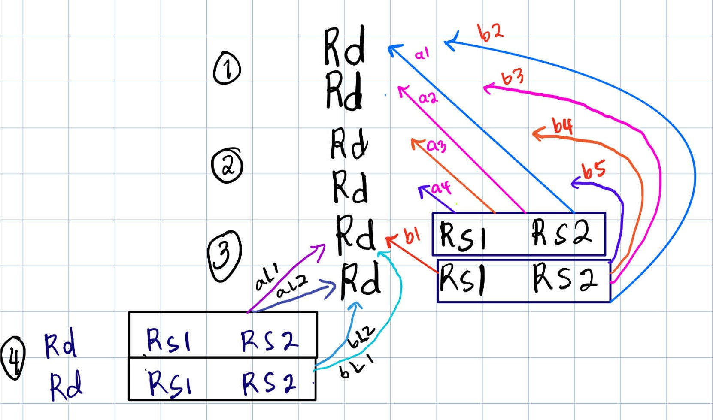
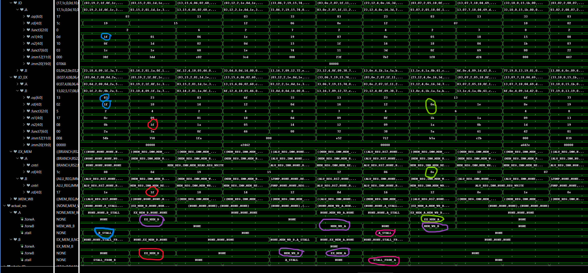
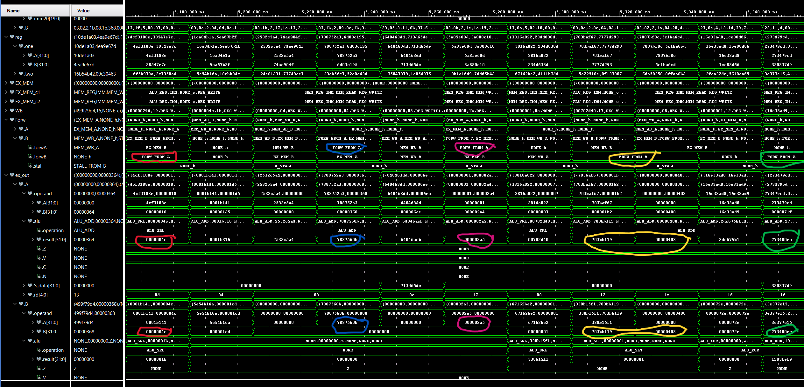

# SUPERSCALAR_CPU
This project implements a simple 2-way superscalar in-order pipelined RISC-V CPU, built collaboratively in VHDL and Verilog.

It extends the concepts of a classic 5-stage pipeline by allowing the CPU to fetch, decode, execute, and commit up to 2 instructions per cycle — increasing throughput while keeping the design modular and understandable.

The design uses a combination of VHDL and Verilog modules to support team collaboration and maintain flexibility across different toolchains.

---

## Key Features
- 2-way superscalar pipeline (dual-issue)
- Mixed VHDL + Verilog design (team-friendly and tool-friendly)
- 4-read / 2-write register file
- Refactored ALU with multi-issue support
- Forwarding and hazard detection for dual-issue
- Randomized verification (> 10,000 cases)
- Clean modular structure — extensible toward out-of-order
- Waveform-based debugging for education and verification

## Goals
- Learn practical superscalar CPU design
- Apply and extend concepts from previous single-issue pipeline
- Build a solid base for future out-of-order CPU
- Practice mixed VHDL + Verilog integration (real-world skill)
- Document progress for portfolio and collaboration

---

## Designs
### HAZARD DETECTION UNIT (HDU)

Note: This is how I implemented the HDU to detect hazards.

The **Hazard Detection Unit (HDU)** identifies data hazards in a dual-issue superscalar pipeline. To design this module, I first created a dependency diagram to visualize potential conflicts between instructions across different pipeline stages.

#### Instruction A (first issued instruction)

For instruction A in the ID_EX stage, hazard checks are performed by comparing its source registers (rs1, rs2) against the destination registers (rd) of instructions ahead in the pipeline. The priority for forwarding or stall is:
- EX_MEM.A
- EX_MEM.B
- MEM_WB.A
- MEM_WB.B

This priority ensures the most recent results are considered first, enabling correct forwarding and reducing stalls.

#### Instruction B (second issued instruction)

Instruction B requires additional logic because it may depend on instruction A, which is issued in the same cycle. This is known as an intra-cycle dependency, and it must be checked before checking future pipeline stages. If B depends on A, and A is performing a register write, B must stall — otherwise it may read incorrect data from the register file too early.

After checking the dependency on A, the same priority logic as instruction A is applied:
- EX_MEM.A
- EX_MEM.B
- MEM_WB.A
- MEM_WB.B
  
Also, if instruction A stalls for any reason (e.g., load-use hazard), instruction B must also stall to maintain instruction pairing and alignment.

#### Load-Use Hazards

Classic load-use hazards are also detected by comparing the source registers of the instruction in ID against both instructions in the ID_EX stage. If an instruction in ID_EX is loading data that a following instruction depends on, a stall is inserted.

#### Summary

This hierarchical approach ensures:
- Correct execution across pipeline stages
- Accurate forwarding paths
- Proper handling of both inter-cycle and intra-cycle hazards
- Minimal and targeted stalling

By handling instruction B’s special case explicitly, the pipeline avoids subtle bugs caused by simultaneous issuance while preserving the performance benefits of dual-issue execution.

The image above demonstrates that the hazard detection unit is functioning correctly. Several dependency cases have been highlighted to illustrate how hazards are identified and handled. Additional screenshots are included to show more examples of detected hazards across different scenarios for both instruction A and B.

---

### EXECUTION (EX) STAGE
The **EX stage** was initially developed in Verilog and integrated into my VHDL-based pipeline using wrapper modules. However, I later refactored the EX stage back to VHDL for several reasons:
- Reduced complexity: Managing both VHDL and Verilog added unnecessary complications to the integrated pipeline.
- Maintainability: Verilog’s lack of native enum support required extra conversion logic, especially in testbenches.
- Cleaner testbench integration: Refactoring to VHDL streamlined simulation and significantly reduced debugging overhead.
- Scalability and flexibility: Working fully in VHDL made it easier to scale up the number of supported instructions and refactor modules efficiently, thanks to the structured nature of my existing VHDL records and design conventions.

**Verification Progress**:

To verify the EX stage, I wrote both SystemVerilog and VHDL testbenches, each serving a unique purpose:
- A SystemVerilog testbench helped me identify and resolve a bug in the forwarding unit where it failed to return zero for undefined cases. This issue has been **fixed and re-verified**. Writing this testbench also allowed me to catch and address various edge cases, with all signals showing clean waveform activity.
- A VHDL testbench gave me fine-grained control over input signals to closely observe the behavior of the integrated module. It was especially useful for monitoring intra-cycle dependencies—such as forw_from_A behavior—to confirm that my design logic performs as expected. The waveform confirms correct forwarding behavior in these cases.

During this process, I also discovered a misleading failure caused by the inclusion of the JAL instruction in the opcode generator. Since JAL bypasses the ALU and EX stage, it appeared as an error in output comparisons. After commenting it out in the helper function for opcode generation, the results aligned exactly as expected — with no actual logic issue.

Although the simulations show that the EX stage is functioning correctly, I recognize the limitations of waveform-only verification and that passing simulation doesn’t always guarantee correct hardware behavior.

**Looking for collaborator/s**:

As I work on developing a more robust testbench for the full integration, I’d love to get feedback or connect with others interested in HDL verification. Whether you’re curious, experienced, or looking to build your skills — your insights or collaboration would mean a lot!
Let’s verify this together — and **push it beyond** just “**it looks right in the waveform.**”

**Known Issues & Considerations**:

If my intra-dependency hazard logic ends up being problematic during synthesis, I’m prepared to explore other options. One path I’m considering is whether instruction B truly needs to stall — or if it’s possible to reorder in-flight instructions (while keeping execution in-order) to avoid unnecessary delays.

**Additional Notes**: In my testbenches, I did not add temporary registers to hold data in the MEM/WB (or WB) stage. My focus was on validating whether the EX stage selects the correct operand based on the forwarding logic and additional internal mechanisms. Specifically, I wanted to verify that the result of instruction A is forwarded correctly for instruction B when intra-instruction dependencies occur.

**Note**:  The highlighted waveform confirms that, during an intra-dependency, instruction A's result is being forwarded and used as instruction B’s operand.

---

### ALU UNIT
Addition and subtraction are now handled directly within the ALU using the + and - operators, rather than through separate gate-level or modular components. Since the operations and results are computed inside the ALU, it made sense to generate the condition flags (C, V, etc.) there as well, where all required inputs are readily available.

While centralizing the flag logic was a necessary design choice based on how the ALU operates, feedback from **Frank Bruno** confirmed that this approach aligns with best practices. He noted that synthesis tools are highly effective at optimizing arithmetic operations and that device-specific implementations can vary—for example, ripple-carry adders are often preferred in FPGAs due to built-in logic support, whereas ASICs may benefit from carry-lookahead or carry-save architectures.

The original gate-level adder and subtractor modules have been moved to the extra/ folder for reference. These legacy modules perform arithmetic only and do not include flag logic, preserving design history while clearly separating computation from control.

---

### DECODER
The Decoder module is designed with a single 32-bit instruction input and a single output structured as a record type. This output aggregates all decoded fields, including opcode, function codes, register indices, and the unshifted immediate value. Resizing and alignment of the immediate field are deferred to the top-level logic within the Instruction Decode (ID) stage. It was also fully verified with 20,000 test cases.

The decoder is fully compliant with the RISC-V instruction set reference and supports all instruction formats. For verification, a dedicated testbench was developed that generates randomized 32-bit values, constrained to ensure only valid RISC-V instructions are produced.

---

### Control Unit
The Control Unit accepts a single input: the 7-bit opcode extracted from the instruction. Based on the opcode, it outputs a structured record containing all relevant control signals required by the datapath. Each control signal is deterministically derived from the opcode type, enabling precise configuration of the processor’s behavior for each instruction class (e.g., R-type, I-type, S-type, etc.).

The use of a record output improves clarity and modularity, making the control logic easier to extend or debug in future design iterations.

---

## Status
**In progress**:
- Nori
    - Register File wrapper
    - Integration of the ff components for the ID stage:
        - HDU
        - Decoders
        - Register
        - Control Unit    
- Venkateshwarlu
    - Register file (4R / 2W) being implemented (Verilog) with testbench (completed)
    - Branch unit with testbench
- Madhu
    - Refactor Data Memory with testbench (completed)

---

**Note**: 
- The **extra** contains the original Verilog implementation of the EX stage, along with wrapper modules for the **ALU** and **forwarding unit**, and the **SystemVerilog** testbench used during that phase.
- Please be aware that this code is **not directly compatible** with the current VHDL-based design — I removed some unused record fields and restructured parts of the interface during the refactor.
- That said, the Verilog version was **fully functional** before those changes were made, and can still serve as a useful reference for the logic or testing approach.

---

## 👤 Contributors
- **Venkateshwarlu Yejella**
- **Madhu Kanithi**

## 👤 Author
**Noridel Herron**  
Senior in Computer Engineering – University of Missouri  
✉️ noridel.herron@gmail.com  
GitHub: [@NoridelHerron](https://github.com/NoridelHerron)

